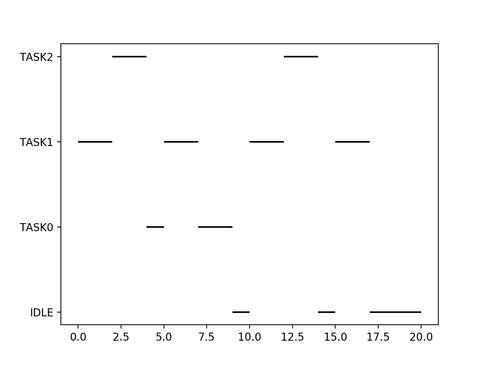
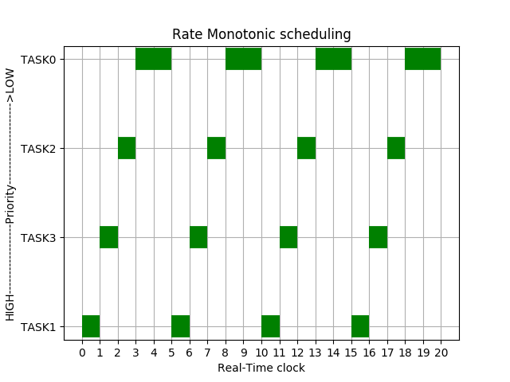
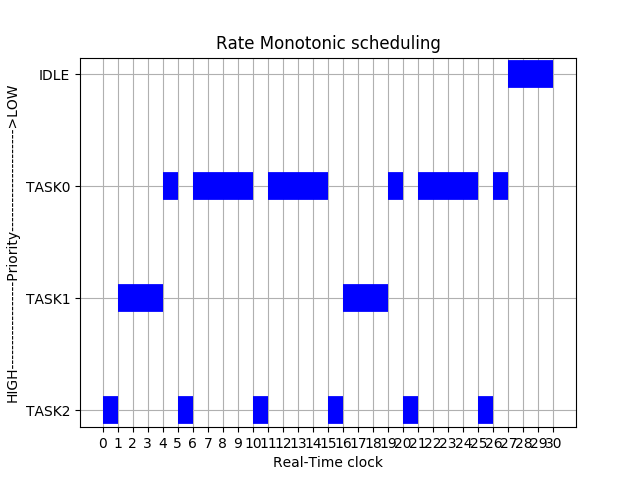

# RateMonotonic_Scheduler

A preemptive fixed priority driven Rate Monotonic scheduler has been implemented successfully in python3 as per the specifications. The software consists of the following parts.

* **Data acquisition**:The scheduler takes input from the user as number of tasks, period and the worst case execution time of each task. The user data is stored in a JSON file in the form of a dictionary which is a simple data structure and a bit faster to process.

* **Schedulability test**:The user data is tested for schedulability using the sufficient and necessary condition for rate monotonic scheduling.

* **Simulation**: The tasks are simulated after the schedulability test in real time until its hyper period. The result of the simulation is displayed in the form of a gantt chart for the user to get a better idea about the functioning of scheduler.

* **Display of metrics**: The release time, start time, finish time, number of releases, average response time and average waiting time has been computed and the results are displayed in the console as well as stored in a JSON file for the user to analyze the resulting metrics of the rate monotonic scheduler at a later time.

## Usage
```
git clone https://github.com/EnigmaRagesh/RateMonotonic_Scheduler.git
cd RateMonotonic_Scheduler
python3 RM_scheduling . py
```
## Sample input 1

|        | Period  | WCET |
|:------:|:-------:|:----:|
| Task 1 |    20   |   8  |
| Task 2 |    5    |   1  |
| Task 3 |    5    |   1  |
| Task 4 |    5    |   1  |
## Gantt Chart output


## sample input 2

|        | Period  | WCET |
|:------:|:-------:|:----:|
| Task 1 |    20   |   8  |
| Task 2 |    5    |   2  |
| Task 3 |    10   |   2  |
## Gantt Chart output


## sample input 3

|        | Period  | WCET |
|:------:|:-------:|:----:|
| Task 1 |    30   |  15  |
| Task 2 |    5    |   1  |
| Task 3 |    15   |   3  |

## Gantt Chart output

